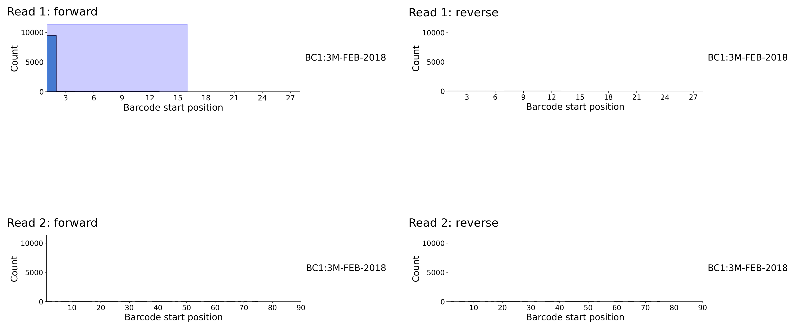

[Back to root](root.md)

# Example: 10X 3'

<picture>
  <source media="(prefers-color-scheme: dark)" srcset="../img/10X3p_dark.svg">
  
</picture>

Library structure

---

### Prep

Stay organised - create a folder for the project to keep things tidy.

```bash
PROJECT=./scarecrow/examples/10X3p
mkdir -p ${PROJECT}
```

Download 10X 3' data from [https://www.ncbi.nlm.nih.gov/bioproject/PRJNA1106903](https://www.ncbi.nlm.nih.gov/bioproject/PRJNA1106903). Instead of `wget`, this time we use `fasterq-dump` as we need one of the technical reads. These accessions are data for two technical replicates.

```bash
mkdir -p ${PROJECT}/fastq
ACCS=(SRR28867562 SRR28867563)
for ACC in ${ACCS[@]}
do
    prefetch --output-directory ${PROJECT}/fastq ${ACC}
    fasterq-dump ${PROJECT}/fastq/${ACC} -e 2 --split-files --include-technical --force --outdir ${PROJECT}/fastq
    gzip ${PROJECT}/fastq/${ACC}_1.fastq
    gzip ${PROJECT}/fastq/${ACC}_2.fastq
    gzip ${PROJECT}/fastq/${ACC}_3.fastq # This read contains the barcode and UMI
    gzip ${PROJECT}/fastq/${ACC}_4.fastq # This read contains the target sequence
done
```

### 1. Generate barcode match profiles

Chromium barcode whitelists for different chemistry versions are available at [https://teichlab.github.io/scg_lib_structs/methods_html/10xChromium3.html](https://teichlab.github.io/scg_lib_structs/methods_html/10xChromium3.html). The library for this sample used the v3.1 chemistry, so the barcode whitelist to use is 3M-february-2018.txt.gz. The file should be downloaded to `${PROJECT}/barcodes`, unzipped and checked that it contains a single barcode per line with no headers. 

There are significantly more barcodes (6.9M) with 10X than Parse. The set-based approach to finding barcodes would require a significant memory footprint. An alternative approach is to use a trie-based method for exact matches, and a k-mer index for approximate matches. As the barcodes are 16 nucleotides in length, we use a k-mer length of 8 to generate the index which will allow a single mismatch to be identified in either half of the barcode. The k-mer index and trie are wrriten to a compressed file via `---pickle`.

```bash
mkdir -p ${PROJECT}/barcode_profiles
FASTQS=(${PROJECT}/fastq/SRR28867562_3.fastq.gz ${PROJECT}/fastq/SRR28867562_4.fastq.gz)
BARCODE=BC1:3M-FEB-2018:${PROJECT}/barcodes/3M-february-2018.txt
sbatch --ntasks 1 --mem 4G --time=01:00:00 -o seed.%j.out -e seed.%j.err \
    scarecrow seed \
      --num_reads 10000 \
      --upper_read_count 100000 \
      --fastqs ${FASTQS[@]}
      --barcodes ${BARCODE} \
      --out ${PROJECT}/barcode_profiles/barcodes.${BARCODE%%:*}.csv \
      --pickle ./barcode_profiles/barcodes.${BARCODE%%:*}.k8.pkl.gz \
      --kmer_length 8
```


### 2. Harvest seed data

The barcode profiles generated by `scarecrow seed` are gathered with `scarecrow harvest` to identify the likely barcode index positions. The `--barcode_count` parameter specifies the number of barcodes to return for **each** barcode index, and should typically be set to `1` unless debugging. The `--min_distance` parameter sets the minimum distance required between the end and start positions of two barcodes. The `--conserved` parameter enables the masking of conserved sequence regions - for instance barcode linker sequences, to prevent barcode positions falling within these regions.

```bash
BARCODE_FILES=(./barcode_profiles/barcodes.*.csv)
sbatch --ntasks 1 --mem 16G --time=01:00:00 -o harvest.%j.out -e harvest.%j.err \
    scarecrow harvest ${BARCODE_FILES[@]} --barcode_count 1 --min_distance 10 \
        --out ./barcode_profiles/barcode_positions.csv

```

The plot generated by `harvest` indicates that a single barcode was found on read 1 in forward orientation

<br>
<picture>
  
</picture>
<br>


The regions for the single barcode selected by the `harvest` is highlighted in blue, and recorded in the barcode_positions.csv file.

```bash
barcode_whitelist,read,orientation,start,end,read_count,read_fraction,barcode_diversity
BC1:3M-FEB-2018,read1,forward,1,16,9456,1.0,0.6745
```

### 3. Extract sequences and barcodes ###

Now that the barcode positions have been characterised we can extract the target sequence with `scarecrow reap` using the pickle file that was generated when running `scarecrow seed`. This will also record barcode metadata (sequence, qualities, corrected sequence, positions, mismatches) and [*optionally*] UMI data (sequence, quailties). The output can be either SAM format (default) or FASTQ. The range to `--extract` includes the read (`1` or `2`) followed by the positional range, and `--umi` follows the same format to indicate where the UMI sequence is. The `--jitter` parameter indicates the number of flanking bases to extend the barcode start position by when looking for a match. The `--mismatch` parameter indicates the maximum number of mismatches permitted when matching the barcode against a whitelist - also known as the edit distance. The `--base_quality` parameter base quality threshold below which bases are masked as `N`, this step occurs before barcode matching and can significantly reduce the number of valid barcodes if set too high. We recommend using the default `10` and applying additional quality filtering to the resulting output as required.


```bash
mkdir -p ${PROJECT}/extracted
THREADS=8
BQ=10
JITTER=0
MISMATCH=1
FASTQS=(${PROJECT}/fastq/SRR28867562_3.fastq.gz ${PROJECT}/fastq/SRR28867562_4.fastq.gz)
BARCODE=BC1:3M-FEB-2018:./barcode_profiles/barcodes.BC1.k8.pkl.gz
OUT=$(basename ${FASTQS[0]%.fastq*})
sbatch --ntasks 1 --cpus-per-task ${THREADS} --mem 64G --time=24:00:00 -o reap.%j.out -e reap.%j.err \
    scarecrow reap \
        --threads ${THREADS} \
        --batch_size 20000 \
        --fastqs ${FASTQS[@]} \
        --barcode_positions ${PROJECT}/barcode_profiles/barcode_positions.csv \
        --barcodes ${BARCODE} \
        --extract 2:1-90 --umi 1:17-28 \
        --jitter ${JITTER} \
        --mismatch ${MISMATCH} \
        --base_quality ${BQ} \
        --out ${PROJECT}/extracted/${OUT} \
        --out_sam
```
