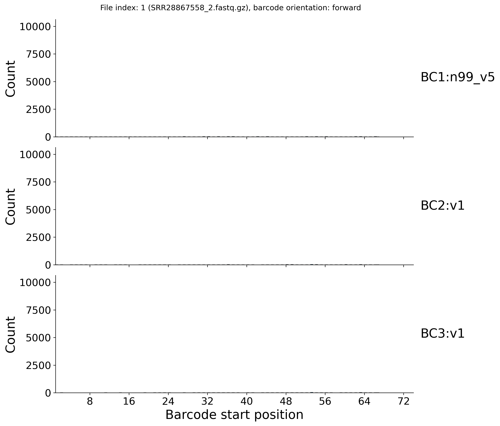
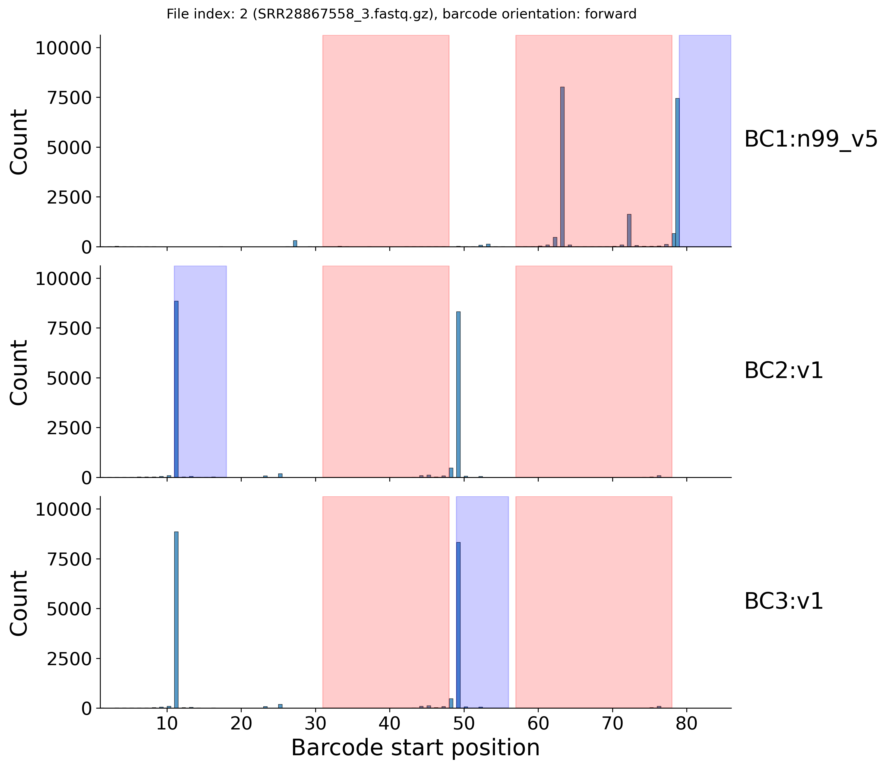
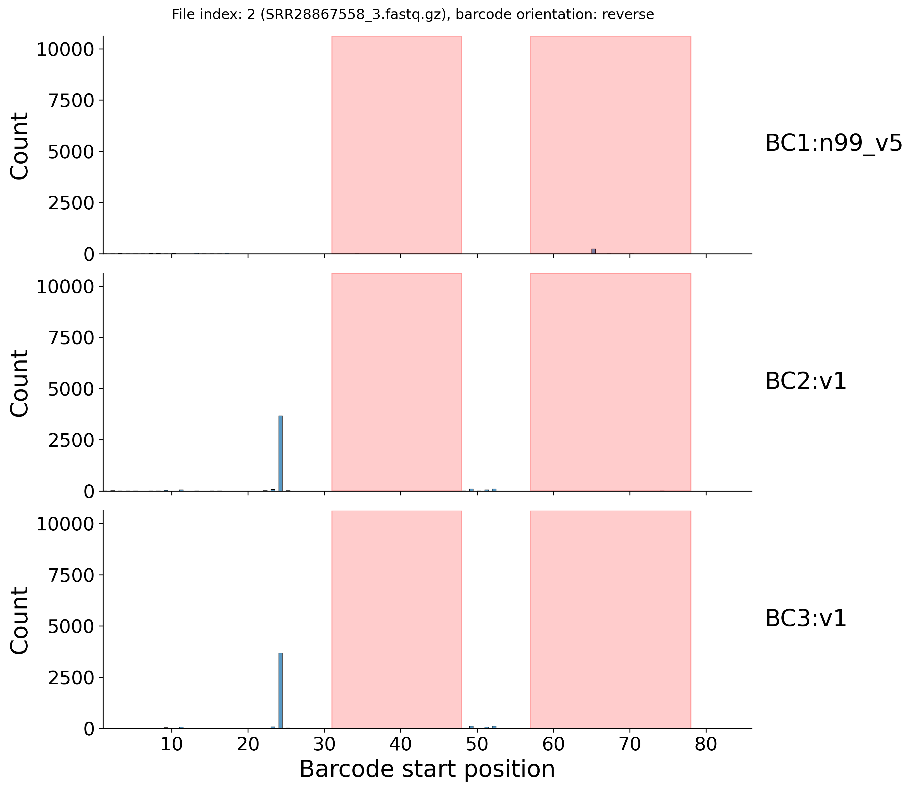

[Back to root](../README.md)

# Example: Parse Evercode WTv2

<picture>
  <source media="(prefers-color-scheme: dark)" srcset="../img/parse_dark_v2.svg">
  
</picture>

Library structure

---

### Prep

Stay organised - create a folder for the project to keep things tidy.

```bash
PROJECT=./scarecrow/examples/Parse
mkdir -p ${PROJECT}
```

Download Evercode WTv2 data from NCBI SRA accession:[SRR28867558](https://www.ncbi.nlm.nih.gov/sra/?term=SRR28867558).

```bash
mkdir -p ${PROJECT}/fastq
ACC=SRR28867558
prefetch --output-directory ${PROJECT}/fastq ${ACC}
fasterq-dump ${PROJECT}/fastq/${ACC} -e 2 --split-files --include-technical --force --outdir ${PROJECT}/fastq
gzip ${PROJECT}/fastq/${ACC}_1.fastq # Index
gzip ${PROJECT}/fastq/${ACC}_2.fastq # cDNA sequences
gzip ${PROJECT}/fastq/${ACC}_3.fastq # Barcodes and UMI
```


### 1. Identify barcode seeds

This step requires barcode whitelists associated with the assay being used. Parse Bioscience customers can access the whitelists for the different assays by downloading their splitpipe pipeline. The whitelists are csv files in a barcodes directory (e.g. ./software/ParseBiosciences-Pipeline.1.4.1/splitpipe/barcodes/barcode_data_v1.csv). We only require the barcode sequence for scarecrow, so this needs cutting from the file (i.e. `cut -d',' -f2 barcode_data_v1.csv | sed '1d' > barcode_data_v1.txt`). Once the whitelists are generated, they can be defined as colon-delimited strings (`<barcode index>:<whitelist name>:<whitelist file>`) in a bash array for later use. For convenience, we have provided in the `scarecrow` repo the below [barcode files](../barcodes/Parse)

```bash
BARCODES=(BC1:n99_v5:${PROJECT}/barcode_whitelists/bc_data_n99_v5.txt
          BC2:v1:${PROJECT}/barcode_whitelists/bc_data_v1.txt
          BC3:v1:${PROJECT}/barcode_whitelists/bc_data_v1.txt)
```

We can now run `scarecrow seed` to process each barcode whitelist. The below example is for a SLURM HPC, but will work on a standard PC by omitting the `sbatch` line. It randomly samples 10k reads from the first 100k in the FASTQ files and records the start positions of barcodes, their orientation, nucleotide frequencies per position, and conserved sequence runs.

```bash
mkdir -p ${PROJECT}/barcode_profiles
FASTQS=(${PROJECT}/fastq/*.fastq.gz)
for BARCODE in ${BARCODES[@]}
do
    scarecrow seed \
        --num_reads 10000 \
        --upper_read_count 100000 \
        --fastqs ${FASTQS[@]} \
        --barcodes ${BARCODE} \
        --out ${PROJECT}/barcode_profiles/barcodes.${BARCODE%%:*}.csv
done
```

The above example uses the default set-based barcode matching method. The alternative is to use the trie-based method which is better suited to much larger barcode whitelists. In the below example we generate a k-mer index with k-mers of length 2 (see [encode](./toolkit_encode.md)).

```bash
K=2
mkdir -p ${PROJECT}/trie_k${K}/barcode_profiles
FASTQS=(${PROJECT}/fastq/*.fastq.gz)
for BARCODE in ${BARCODES[@]}
do
    scarecrow seed \
        --num_reads 10000 \
        --upper_read_count 100000 \
        --fastqs ${FASTQS[@]} \
        --barcodes ${BARCODE} \
        --pickle ${PROJECT}/trie_k${K}/barcodes.${BARCODE%%:*}.pkl.gz \
        --kmer_length ${K} \
        --out ${PROJECT}/trie_k${K}/barcode_profiles/barcodes.${BARCODE%%:*}.csv
done
```

### 2. Harvest barcode profiles

The barcode profiles generated by `scarecrow seed` are gathered with `scarecrow harvest` to identify the likely barcode index positions. The `--barcode_count` parameter specifies the number of barcodes to return for **each** barcode index, and should typically be set to `1` unless debugging. The `--min_distance` parameter sets the minimum distance required between the end and start positions of two barcodes. The `--conserved` parameter enables the masking of conserved sequence regions - for instance barcode linker sequences, to prevent barcode positions falling within these regions.

```bash
BARCODE_FILES=(${PROJECT}/barcode_profiles/barcodes.*.csv)
scarecrow harvest \
    ${BARCODE_FILES[@]} \
    --barcode_count 1 \
    --min_distance 10 \
    --conserved ${PROJECT}/barcode_profiles/barcodes.${BARCODES[0]%%:*}_conserved.tsv \
    --out ${PROJECT}/barcode_profiles/barcode_positions.csv
```

Both the set- and trie-based methods are processed in the same manner with `harvest`. However, to illustrate that the same barcode profiles are generated, we can repeat the above on the trie-based method outputs from `seed`.

```bash
BARCODE_FILES=(${PROJECT}/trie_k${K}/barcode_profiles/barcodes.*.csv)
scarecrow harvest \
    ${BARCODE_FILES[@]} \
    --barcode_count 1 \
    --min_distance 10 \
    --conserved ${PROJECT}/trie_k${K}/barcode_profiles/barcodes.${BARCODES[0]%%:*}_conserved.tsv \
    --out ${PROJECT}/trie_k${K}/barcode_profiles/barcode_positions.csv
```

The plots generated by `harvest` indicates that no barcode matches were found on read 1 (SRR28867558_1.fastq.gz), virtually no barcode matches were found on read 2 (SRR28867558_2.fastq.gz), regardless of barcode orientation, while matches were found on read 3 (SRR28867558_3.fastq.gz) in both orientations. The majority of reads returned matches at positions 11, 49, and 79 in forward orientation, which correspond with the positions of the 3 barcodes expected of the assay. An additional peak was identified in a conserved region (highlighted in red) that corresponds with one of the linker sequences of the assay. As this peak falls within a conserved region it is ignored.

<br>
<table>
  <tr>
    <td></td>
    <td></td>
  </tr>
  <tr>
    <td></td>
    <td></td>
  </tr>
</table>
<br>

The regions for the three barcodes (one per whitelist) selected by the `harvest` are highlighted in blue. These are recorded in the barcode_positions.csv file. Note, file_index is 0-based.

```bash
barcode_whitelist,file_index,file,orientation,start,end,read_count,read_fraction
BC2:v1,2,SRR28867558_3.fastq.gz,forward,11,18,8850,0.93
BC3:v1,2,SRR28867558_3.fastq.gz,forward,49,56,8327,0.87
BC1:n99_v5,2,SRR28867558_3.fastq.gz,forward,79,86,7447,0.8
```


### 3. Reap sequence data ###

Now that the barcode positions have been characterised we can extract the target sequence with `scarecrow reap`. This will also record barcode metadata (sequence, qualities, corrected sequence, positions, mismatches) and UMI data (sequence, quailties). The output can be either SAM format (default) or FASTQ. The range to `--extract` includes the read index (e.g. `1` or `2`) followed by the positional range, and `--umi` follows the same format to indicate where the UMI sequence is. The `--jitter` parameter indicates the number of flanking bases to extend the barcode start position by when looking for a match. The `--mismatch` parameter indicates the maximum number of mismatches permitted when matching the barcode against a whitelist - also known as the edit distance. The `--base_quality` parameter base quality threshold, below which bases are masked as `N`, this step occurs before barcode matching and can significantly reduce the number of valid barcodes if set too high. For a fair comparison with the Parse splitpipe workflow we do not apply any base quality masking in this instance.

```bash
THREADS=16
JITTER=2
MISMATCH=2
FASTQS=(${PROJECT}/fastq/*.fastq.gz)
OUT=$(basename ${FASTQS[0]%.fastq*})
mkdir -p ${PROJECT}/extracted/J${JITTER}M${MISMATCH}
sbatch -p uoa-compute --ntasks 1 --cpus-per-task ${THREADS} \
    --mem 16G --time=12:00:00 -o reap.%j.out -e reap.%j.err \
    scarecrow reap \
        --threads ${THREADS} \
        --batch_size 20000 \
        --fastqs ${FASTQS[@]} \
        --barcode_positions ${PROJECT}/barcode_profiles/barcode_positions.csv \
        --barcodes ${BARCODES[@]} \
        --extract 2:1-74 --umi 3:1-10 \
        --jitter ${JITTER} \
        --mismatch ${MISMATCH} \
        --out ${PROJECT}/extracted/J${JITTER}M${MISMATCH}/${OUT} \
        --out_fastq
```

**(Optional)**  Check that the read count in the resulting FASTQ file is equal to that of one of the input FASTQ files. This is a basic sanity check to ensure that nothing unexpected happened whilst running `scarecrow` on the HPC that might have resulted in some I/O issues. Here is an example of counting reads using `seqtk` and `awk` on non-interleaved and interleaved FASTQ files.

```bash
# A non-interleaved input FASTQ file
seqtk seq ${FASTQS[0]} | awk '/^@/ {c++} END {print c}'
# Interleaved scarecrow FASTQ file
seqtk seq ${PROJECT}/extracted/J${JITTER}M${MISMATCH}/${OUT}.fastq | awk '/^@/ {c++} END {print c/2}'
```

In addition to generating an interleaved FASTQ file, `scarecrow` outputs a JSON file indicating the barcode and UMI positions on read 1, and the parameters required to use the file with the `kb count` tool of `kallisto-bustools`. In addition, the tools outputs a `_mismatch_stats.csv` and a `_position_stats.csv` file. The mismatch_stats CSV has the following format:

```bash
mismatches,count
-3,3814125
-2,3590285
-1,14409173
0,125784335
1,11300683
2,6035706
3,1026087
4,823998
5,391577
6,298803
```

Indicating the number of reads recorded for each sum of mismatches across its barcodes. For example, allowing up to 2 mismatches for 3 barcodes will sum to 6 if each barcode has 2 mismatches. Negative numbers indicate the number of reads for which no barcode was found (i.e. -1 is one barcode unmatched, -2 is two barcodes unmatched, ...).

The position_stats CSV follows a similar format, indicating the count of barcodes starting at each position within `--jitter 1` :

```bash
position,count
*,11950
10,3658309
11,154983669
12,1527298
48,9795569
49,146681602
50,2644153
78,13877626
79,133791532
80,2420490
N,33032118
```

The asterisk (*) position indicates for those barcodes that more than one match for the same barcode sequence was found with the same number of mismatches and distance. In such instances, the barcode and number of mismatches are known however the exact position is not. The position counts shown above illustrate that millions of reads have barcodes not starting at the expected positions.

If using the trie-based method, `reap` would be run using the pickle indices instead of the whitelists, as follows:

```bash
THREADS=16
JITTER=1
MISMATCH=2
FASTQS=(${PROJECT}/fastq/*.fastq.gz)
BARCODES=(BC1:n99_v5:${PROJECT}/trie_k${K}/barcodes.BC1.pkl.gz
          BC2:v1:${PROJECT}/trie_k${K}/barcodes.BC2.pkl.gz
          BC3:v1:${PROJECT}/trie_k${K}/barcodes.BC3.pkl.gz)
OUT=$(basename ${FASTQS[0]%.fastq*})
mkdir -p ${PROJECT}/extracted/trie_k${K}/J${JITTER}M${MISMATCH}
sbatch -p uoa-compute --ntasks 1 --cpus-per-task ${THREADS} --mem 16G --time=12:00:00 -o reap.%j.out -e reap.%j.err \
    scarecrow reap \
        --threads ${THREADS} \
        --batch_size 20000 \
        --fastqs ${FASTQS[@]} \
        --barcode_positions ${PROJECT}/trie_k${K}/barcode_profiles/barcode_positions.csv \
        --barcodes ${BARCODES[@]} \
        --extract 2:1-74 --umi 3:1-10 \
        --jitter ${JITTER} \
        --mismatch ${MISMATCH} \
        --out ${PROJECT}/extracted/trie_k${K}/J${JITTER}M${MISMATCH}/${OUT} \
        --out_fastq
```

The below table summarises the number of mismatches identified at each jitter from 0 to 2, allowing upto 2 mismatches.

| Mis | Jitter 0  | Jitter 1  | Jitter 2  |
| --- | --------- | --------- | --------- |
| -3  | 6577880   | 3814125   | 3433420   |
| -2  | 9108695   | 3590285   | 2325977   |
| -1  | 18855850  | 14409173  | 13060489  |
| 0   | 119851052 | 125784335 | 126768927 |
| 1   | 7350721   | 11300683  | 12071477  |
| 2   | 3709152   | 6035706   | 6885939   |
| 3   | 647834    | 1026087   | 1217658   |
| 4   | 832710    | 823998    | 993382    |
| 5   | 284521    | 391577    | 423432    |
| 6   | 256357    | 298803    | 294071    |

The number of valid barcodes is the sum of those with >=0 mismatches. This can be easily calculated from the mismatch stats file.

```bash
OUT=$(basename ${FASTQS[0]%.gz})
awk -F, 'NR>1 && $1 >= 0 {sum += $2} END {print sum}' $PROJECT/extracted/J${JITTER}M${MISMATCH}/${OUT}_mismatch_stats.csv
```

The below table summarises the number of barcode position matches identified at each jitter from 0 to 2, allowing upto 2 mismatches.

| Pos | Jitter 0  | Jitter 1  | Jitter 2  |
| --- | --------- | --------- | --------- |
| *   |           | 11950     | 13501     |
| 9   |           |           | 824455    |
| 10  |           | 3658309   | 3599189   |
| 11  | 155509351 | 154983669 | 154669696 |
| 12  |           | 1527298   | 1449340   |
| 13  |           |           | 525384    |
| 47  |           |           | 2067460   |
| 48  |           | 9795569   | 9485814   |
| 49  | 150818590 | 146681602 | 146188365 |
| 50  |           | 2644153   | 2350402   |
| 51  |           |           | 667344    |
| 77  |           |           | 3619040   |
| 78  |           | 13877626  | 13545713  |
| 79  | 139289495 | 133791532 | 133008992 |
| 80  |           | 2420490   | 2252858   |
| 81  |           |           | 144060    |
| N   | 56806880  | 33032118  | 28012703  |

The Parse barcode whitelists have 96 (v1) and 99 (n99_v5) 8-mer barcodes. Given the small size of these whitelists the default set-based method is more efficient, as evident from the SLURM job logs summarised below (JITTER = 1, MISMATCH = 2).

| Method            | CPU Utilized | CPU Efficiency | Wall-clock time | Memory Utilized |
| ----------------- | ------------ | -------------- | --------------- | --------------- |
| Set (J0M2)        | 02:07:31     | 21.86%         | 00:36:27        | 2.68 GB         |
| Set (J1M2)        | 03:36:57     | 33.62%         | 00:40:20        | 2.72 GB         |
| Set (J2M2)        | 04:12:36     | 40.62%         | 00:38:52        | 2.72 GB         |
| Trie 2-mer (J1M2) | 4-15:32:29   | 98.45%         | 07:04:53        | 4.55 GB         |
| Trie 3-mer (J1M2) | 1-09:57:46   | 94.22%         | 02:15:10        | 4.08 GB         |
| Trie 4-mer (J1M2) | 20:57:10     | 92.51%         | 01:24:56        | 3.98 GB         |
| Trie 5-mer (J1M2) | 13:34:59     | 87.54%         | 00:58:11        | 2.52 GB         |
| Trie 6-mer (J1M2) | 08:13:44     | 67.11%         | 00:45:59        | 2.42 GB         |

The tables below show the impact of setting an inappropriate k-mer value when using the trie-based method. In the first table, each column reports the count of reads with barcodes matched to the position indicated. In the second table, each column reports the count of reads with the total number of mismatches across barcodes where negative values indicate the number of invalid barcodes (no match). The set-based method is considered the ground truth and is replicated when using k = 2 with the trie method. If the k-mer is too large then the accuracy of barcode matching suffers due to mismatches falling within the k-mers.

| Pos | Set       | Trie 2-mer | Trie 3-mer | Trie 4-mer | Trie 5-mer | Trie 6-mer |
| --- | --------- | ---------- | ---------- | ---------- | ---------- | ---------- |
| *   | 11950     | 11950      | 11988      | 8152       | 11843      | 6071       |
| 10  | 3658309   | 3658309    | 3663823    | 3785693    | 3888398    | 3390339    |
| 11  | 154983669 | 154983669  | 154981920  | 154701061  | 153298237  | 151604556  |
| 12  | 1527298   | 1527298    | 1528606    | 1564047    | 1472566    | 1048374    |
| 48  | 9795569   | 9795569    | 9792052    | 9861905    | 9695046    | 9130888    |
| 49  | 146681602 | 146681602  | 146675394  | 146376829  | 144799302  | 142717487  |
| 50  | 2644153   | 2644153    | 2662371    | 2704726    | 2647680    | 1923432    |
| 78  | 13877626  | 13877626   | 13905394   | 13887416   | 13412962   | 12735435   |
| 79  | 133791532 | 133791532  | 133758289  | 133625609  | 131557243  | 129348507  |
| 80  | 2420490   | 2420490    | 2428335    | 2528366    | 2663722    | 2782882    |
| N   | 33032118  | 33032118   | 33016144   | 33380512   | 38977317   | 47736345   |

| Mis | Set       | Trie 2-mer | Trie 3-mer | Trie 4-mer | Trie 5-mer | Trie 6-mer |
| --- | --------- | ---------- | ---------- | ---------- | ---------- | ---------- |
| -3  | 3814125   | 3814125    | 3821417    | 3950154    | 4544847    | 6105208    |
| -2  | 3590285   | 3590285    | 3601391    | 3715548    | 4784020    | 6084574    |
| -1  | 14409173  | 14409173   | 14349111   | 14098954   | 15774736   | 17251573   |
| 0   | 125784335 | 125784335  | 125784335  | 125784335  | 125784335  | 125784335  |
| 1   | 11300683  | 11300683   | 11300683   | 11300683   | 9740882    | 7941158    |
| 2   | 6035706   | 6035706    | 6064388    | 6285478    | 5368152    | 3787885    |
| 3   | 1026087   | 1026087    | 1027520    | 1020284    | 757018     | 353232     |
| 4   | 823998    | 823998     | 834750     | 718951     | 424503     | 121785     |
| 5   | 391577    | 391577     | 393330     | 356559     | 190633     | 32598      |
| 6   | 298803    | 298803     | 297847     | 243826     | 105646     | 12424      |


### 4. Sift reads with invalid barcodes

Reads with one or more invalid barcode are uninformative in downstream analyses as they could not be confidently demultiplexed. We can filter these reads out either by using the `--sift` flag when running `reap`, or by using the `sift` tool afterwards. Here we demonstrate `sift` after running `reap`. As we are providing a `scarecrow` FASTQ input we also need to provide the accompanying JSON file. If a `scarecrow` SAM input is provided then no JSON file is required.

```bash
OUT=$(basename ${FASTQS[0]%.fastq.gz})
FASTQ=${PROJECT}/extracted/J${JITTER}M${MISMATCH}/${OUT}.fastq
sbatch -p uoa-compute --ntasks 1 --mem 2G --time=12:00:00 -o sift.%j.out -e sift.%j.err \
            scarecrow sift --in ${FASTQ} --json ${FASTQ%.fastq}.json
```
# 2711033 (J0)
# 2711027 (J1)
# 2711034 (J2)

### 5. Trim TSO sequences

To improve downstream alignment results it is highly recommended to trim the reads to remove and adapter sequences or template switching oligo (TSO) sequences. Not all reads possess these sequences, and those that do will not necessarily share the same start position. There is an updated fastqc contaminants list in the Parse splitpipe repo, which we can format for use with cutadapt and supplement with the Parse TSO sequence `AACGCAGAGTGAATGGG`. Below illustrates how this was achieved, and for convenience we have included in the `scarecrow` repo the processed [contaminants list](../contaminants/contaminants.fasta). Note, we use the `-G` rather than the `-g` flag for `cutadapt` because the sequence to be trimmed is on the read 2 output by `scarecrow`, rather than read 1 - which now sotres the barcode and UMI sequences.

```bash
CONTAMINANTS=./software/ParseBiosciences-Pipeline.1.4.1/splitpipe/scripts/config/fastqc-contaminant_list.txt
awk '
# Skip blank lines and comment lines
NF && $0 !~ /^#/ {
  seq = $NF
  header = ""
  for (i = 1; i < NF; i++) {
    header = header $i " "
  }
  gsub(/[ \t]+$/, "", header)
  # Use a separate array to track seen sequences
  if (header != "" && !(seq in seen)) {
    seen[seq] = 1
    print ">" header
    print seq
  }
}
' ${CONTAMINANTS} > ${PROJECT}/contaminants.fasta

# Add Parse Bio TSO sequence to contaminants
sed -i '$ a >Parse Bio TSO sequence\nAACGCAGAGTGAATGGG' ./${PROJECT}/contaminants.fasta

OUT=$(basename ${FASTQS[0]%.fastq.gz})
FASTQ=$(basename ${PROJECT}/extracted/J${JITTER}M${MISMATCH}/${OUT}_sift.fastq)
sbatch -p uoa-compute --ntasks 1 --cpus-per-task 4 --mem 16G --time=12:00:00 -o cutadapt.%j.out -e cutadapt.%j.err \
    cutadapt --cores 4 --trim-n --minimum-length 30 --interleaved \
        -G file:${PROJECT}/contaminants.fasta \
        -o ${PROJECT}/extracted/J${JITTER}M${MISMATCH}/${FASTQ%_sift.fastq}_trimmed.fastq \
        ${PROJECT}/extracted/J${JITTER}M${MISMATCH}/${FASTQ}
```
# 2711118 (J0)
# 2711119 (J1)
# 2711120 (J2)

### 6. Generate barcode statistics

```bash
OUT=$(basename ${FASTQS[0]%.fastq.gz})
FASTQ=${PROJECT}/extracted/J${JITTER}M${MISMATCH}/${OUT}_trimmed.fastq
sbatch -p uoa-compute --ntasks 1 --mem 4G --time=12:00:00 -o stats.%j.out -e stats.%j.err \
            scarecrow stats --in ${FASTQ}
```
# 2720029 (J0)
# 2711155 (J1)
# 2711156 (J2)

### 7. Generate count matrix via kallisto-bustools

Next we can generate a count matrix using `kallisto`. There is a script in the scarecrow repo, [kallisto.sh](../src/HPC/kallisto.sh), that parses the JSON file generated by `reap` to retrieve the `-x` string required for running the FASTQ file with `kb count`. This requires the JSON sed-like processor, [`jq`](https://jqlang.org), to be installed. This enables the `-x` flag to be extracted as follows:

```bash
XSTR=$(${jq} -r '."kallisto-bustools"[0]."kb count" | capture("-x (?<x>[^ ]+)").x' ${JSON})
```

The `kallisto.sh` script requires the `kallisto` `--index` and `--genes` for the reference assembly in question, in addition to the FASTQ and JSON files generated by `scarecrow`.

```bash
#conda deactivate
#mamba activate kallisto
mkdir -p ${PROJECT}/kallisto/J${JITTER}M${MISMATCH}
OUT=$(basename ${FASTQS[0]%.fastq.gz})
FASTQ=$(basename ${PROJECT}/extracted/J${JITTER}M${MISMATCH}/${OUT}_trimmed.fastq)
sbatch -p uoa-compute --ntasks 1 --cpus-per-task 8 --mem 4G --time=12:00:00 \
    ~/sharedscratch/scarecrow/scripts/kallisto.sh \
        --index /uoa/scratch/users/s14dw4/software/kallisto/hg38/transcriptome.idx \
        --genes /uoa/scratch/users/s14dw4/software/kallisto/hg38/transcripts_to_genes.txt \
        --fastq ${PROJECT}/extracted/J${JITTER}M${MISMATCH}/${FASTQ} \
        --json ${PROJECT}/extracted/J${JITTER}M${MISMATCH}/${FASTQ%_trimmed.fastq}.json \
        --out ${PROJECT}/kallisto/J${JITTER}M${MISMATCH}/${FASTQ%.fastq}
```
# 2711165 (J0)
# 2711166 (J1)
# 2711167 (J2)

### 8. Generate count matrix via STAR and umi-tools

Before aligning with STAR, if we wish to incoprorate the barcode and UMI read tags we should first recast the FASTQ file to SAM format.

```bash
OUT=$(basename ${FASTQS[0]%.fastq.gz})
FASTQ=${PROJECT}/extracted/J${JITTER}M${MISMATCH}/${OUT}_trimmed.fastq
sbatch -p uoa-compute --ntasks 1 --mem 2G --time=24:00:00 -o recast.%j.out -e recast.%j.err \
            scarecrow recast --in ${FASTQ}
```
# 2711256 (J0)
# 2711257 (J1)
# 2711258 (J2)


Next, we align with `STAR` from `scarecow` SAM format. For fair comparison with the Parse split-pipe results, we include the `--clip3pAdapterSeq` used in their pipeline.

```bash
/uoa/scratch/users/s14dw4/software/STAR --runThreadN ${SLURM_CPUS_PER_TASK} \
        --genomeDir ${GENOME} \
        --readFilesIn ${SAM} \
        --readFilesType SAM SE \
        --outFileNamePrefix ${OUT}/${ID}. \
        --outSAMtype BAM Unsorted \
        --clip3pAdapterSeq CCACAGTCTCAAGCACGTGGAT \
        --outFilterMultimapNmax 3
```

The script is run on the HPC as follows:

```bash
mkdir -p ${PROJECT}/star/J${JITTER}M${MISMATCH}
OUT=$(basename ${FASTQS[0]%.fastq.gz})
SAM=${PROJECT}/extracted/J${JITTER}M${MISMATCH}/${OUT}_trimmed.sam
ID=$(basename ${SAM%.sam})
GENOME=/uoa/scratch/users/s14dw4/spipe/genomes/hg38
sbatch -p uoa-compute --ntasks 1 --cpus-per-task 32 --mem 24G --time=02:00:00 -o star.%j.out -e star.%j.err \
    ./scarecrow/scripts/star_align_sam_parse.sh \
        --genome ${GENOME} \
        --sam ${SAM} \
        --out ${PROJECT}/star/J${JITTER}M${MISMATCH}
```
# 2711476 (J0)
# 2711477 (J1)
# 2711478 (J2)

Next step is to run `umi-tools`. The reference GTF file we use for this has a slighltly different config naming convention to the reference we used for alignment with `STAR`. To address this issue we generate an alias file for use with `featureCounts` from the `subread` package, see the `umi-tools` [single-cell tutorial](https://umi-tools.readthedocs.io/en/latest/Single_cell_tutorial.html) for more details. We have included a script in the `scarecrow` repo, [umi_tools.sh](../src/HPC/umi_tools.sh) which runs `featureCounts` followed by `umi-tools count` to generate a counts matrix.

```bash
GTF=/uoa/scratch/shared/Morgan_Lab/common_resources/cellranger/reference/refdata-gex-GRCh38-2020-A/genes/genes.gtf
OUT=$(basename ${FASTQS[0]%.fastq.gz})
BAM=${PROJECT}/star/J${JITTER}M${MISMATCH}/*.bam

# Need to create contig look-up as GTF does not have hg38_ prefix to contigs
mkdir -p ${PROJECT}/umi_tools/J${JITTER}M${MISMATCH}
#mamba activate samtools_env
samtools view -H ${BAM} | cut -f2 | grep "^SN" | sed 's/SN://g' | \
    awk '{split($0, TIG, "_"); print TIG[2]","$0;}' > ${PROJECT}/umi_tools/alias.file

# Run UMI-tools
sbatch --partition uoa-compute ./scarecrow/scripts/umi_tools.sh \
    --bam ${BAM} \
    --gtf ${GTF} \
    --out ${PROJECT}/umi_tools/J${JITTER}M${MISMATCH} \
    --alias ${PROJECT}/umi_tools/alias.file
```

# 2712579 (J0)
# 2712580 (J1)
# 2712571 (J2)

# <------------------------------------------------------------------ here


Next, the umi_tools output can be converted to a matrix format for downstream processing in R in a similar manner to the `kallisto` output.

```bash
COUNTS=${PROJECT}/umi_tools/J${JITTER}M${MISMATCH}/*.featureCounts.counts.tsv.gz
sbatch --partition uoa-compute ./scarecrow/scripts/counts2mtx.sh --in ${COUNTS}
```
