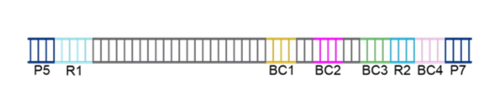

[Back to root](root.md)

# Example: Parse Evercode WTv2



Stay organised - create a folder for the project to keep things tidy.

```bash
PROJECT=./scarecrow/examples/evercode
mkdir -p ${PROJECT}
```

Download Evercode WTv2 data from [https://www.ebi.ac.uk/ena/browser/view/PRJNA1106903](https://www.ebi.ac.uk/ena/browser/view/PRJNA1106903).

```bash
mkdir -p ${PROJECT}/fastq
wget -nc -P ${PROJECT}/fastq ftp.sra.ebi.ac.uk/vol1/fastq/SRR288/058/SRR28867558/SRR28867558_1.fastq.gz
wget -nc -P ${PROJECT}/fastq ftp.sra.ebi.ac.uk/vol1/fastq/SRR288/058/SRR28867558/SRR28867558_2.fastq.gz
```

### 1. Extract subset of 1M reads for profiling

```bash
mkdir -p ${PROJECT}/fastq/subset
FILES=(${PROJECT}/fastq/*.fastq.gz)
for FILE in ${FILES[@]}
do
    ID=$(basename ${FILE%.fast*})
    zcat -c ${FILE} | head --l 4000000 | gzip > ${PROJECT}/fastq/subset/${ID}.fastq.gz
done
```

### 2. Generate barcode match profiles

This step requires barcode whitelists associated with the assay being used. Parse Bioscience customers can access the whitelists for the different assays by downloading their splitpipe pipeline. The whitelists are csv files in a barcodes directory (e.g. barcode_data_v1.csv). We only require the barcode sequence for scarecrow, so this needs cutting from the file (i.e. `cut -d',' -f2 barcode_data_v1.csv | sed '1d' > barcode_data_v1.txt`). Once the whitelists are generated, they can be defined as colon-delimited strings (`<barcode index>:<whitelist name>:<whitelist file>`) in a bash array for later use.

```bash
BARCODES=(BC1:n99_v5:${PROJECT}/barcode_whitelists/bc_data_n99_v5.txt
          BC2:v1:${PROJECT}/barcode_whitelists/bc_data_v1.txt
          BC3:v1:${PROJECT}/barcode_whitelists/bc_data_v1.txt)
```

We can now run `scarecrow seed` to process each barcode whitelist. The below example is for a SLURM HPC, but will work on a standard PC by omitting the `sbatch` line.

***check RAM usage before finalising documentation***

```bash
mkdir -p ${PROJECT}/barcode_profiles
THREADS=1
FASTQS=(${PROJECT}/fastq/subset/*.fastq.gz)
for BARCODE in ${BARCODES[@]}
do
    sbatch --ntasks ${THREADS} --mem 4G --time=01:00:00 -o seed.%j.out -e seed.%j.err \
        scarecrow seed --threads ${THREADS} \
            --fastqs ${FASTQS[@]} --strands pos neg \
            --barcodes ${BARCODE} \
            --out ${PROJECT}/barcode_profiles/barcodes.${BARCODE%%:*}.csv
done
```

### 3. Process barcode profiles

The resulting barcode profiles are gathered together with `scarecrow harvest` to identify the most likely barcode positions. The `--barcode_count` parameter specifies the number of barcodes to return for **each** barcode index, and should typically be set to `1` unless debugging. The `--min_distance` parameter sets the minimum distance required between the end and start positions of two barcodes. The `--conserved` parameter allows us to mask regions of sequence that are conserved across reads, for instance barcode linker sequences.

***check RAM usage before finalising documentation***

```bash
BARCODE_FILES=(${PROJECT}/barcode_profiles/Parse/barcodes.*.csv)
sbatch --ntasks 1 --mem 16G --time=01:00:00 -o harvest.%j.out -e harvest.%j.err \
    scarecrow harvest ${BARCODE_FILES[@]} --barcode_count 1 --min_distance 10 \
        --conserved ${PROJECT}/barcode_profiles/Parse/barcodes.${BARCODES[0]%%:*}_conserved.tsv \
        --out ${PROJECT}/barcode_profiles/Parse/barcode_positions.csv
```

### 4. Extract target sequence to fastq ###

Now that the barcode positions have been characterised we can extract the target sequence with `scarecrow reap`. This will store barcode metadata (sequence, qualities, corrected sequence, positions, mismatches) and [optionally] UMI data (sequence, quailties) in the fastq sequence header. The `--barcode_reverse_order` flag simply determines the order of barcode sequences in the header. The range to `--extract` includes the read (`1` or `2`) followed by the range, and `--umi` follows the same format to indicate where the UMI sequence is. The `--jitter` parameter indicates the number of flanking bases to extend the barcode start position by when looking for a match. The `--mismatch` parameter indicates the maximum number of mismatches permitted when matching the barcode against a whitelist - also known as the edit distance. The `--base_quality` parameter base quality threshold below which bases are masked as `N`, this step occurs before barcode matching and can significantly reduce the number of valid barcodes if set too high. We recommend using the default `10` and applying additional quality filtering to the resulting fastq if required.

***does barcode_reverse_order update the other barcode metadata order?***

***UMI sequence position is more complicated in other libraries and may need to account for jitter***

```bash
mkdir -p ${PROJECT}/extracted
THREADS=16
BQ=10
JITTER=2
MISMATCH=2
FASTQS=(${PROJECT}/fastq/*.fastq.gz)
OUT=$(basename ${FASTQS[0]%.gz})
sbatch --ntasks ${THREADS} --mem 4G --time=12:00:00 -o reap.%j.out -e reap.%j.err \
    scarecrow reap --threads ${THREADS} --batch_size 20000 \
        --fastqs ${FASTQS[@]} \
        -p ${PROJECT}/barcode_profiles/barcode_positions.csv \
        --barcode_reverse_order \
        --barcodes ${BARCODES[@]} \
        --extract 1:1-74 --umi 2:1-10 \
        --jitter ${JITTER} --mismatch ${MISMATCH} --base_quality ${BQ} \
        --out ${PROJECT}/extracted/${OUT} 
```                


