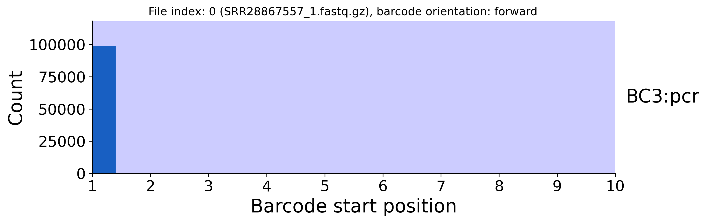
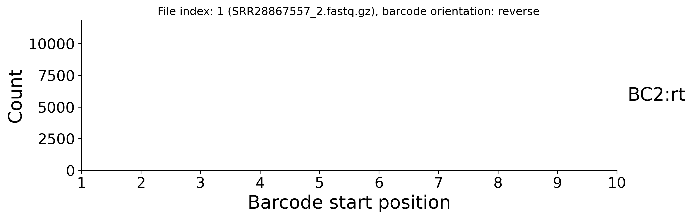
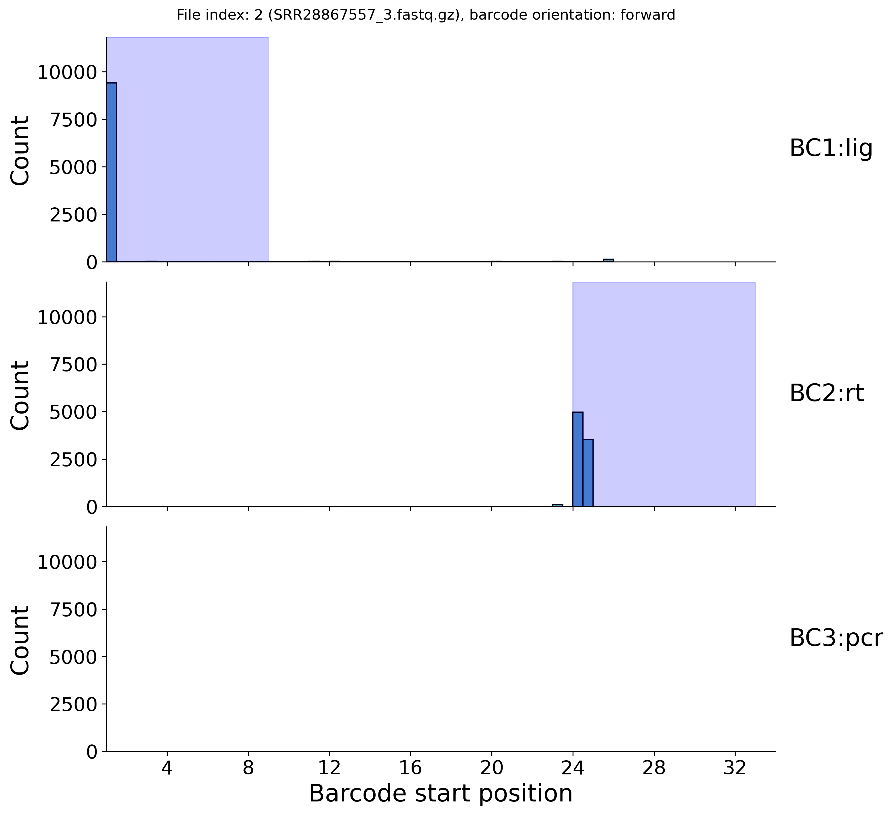
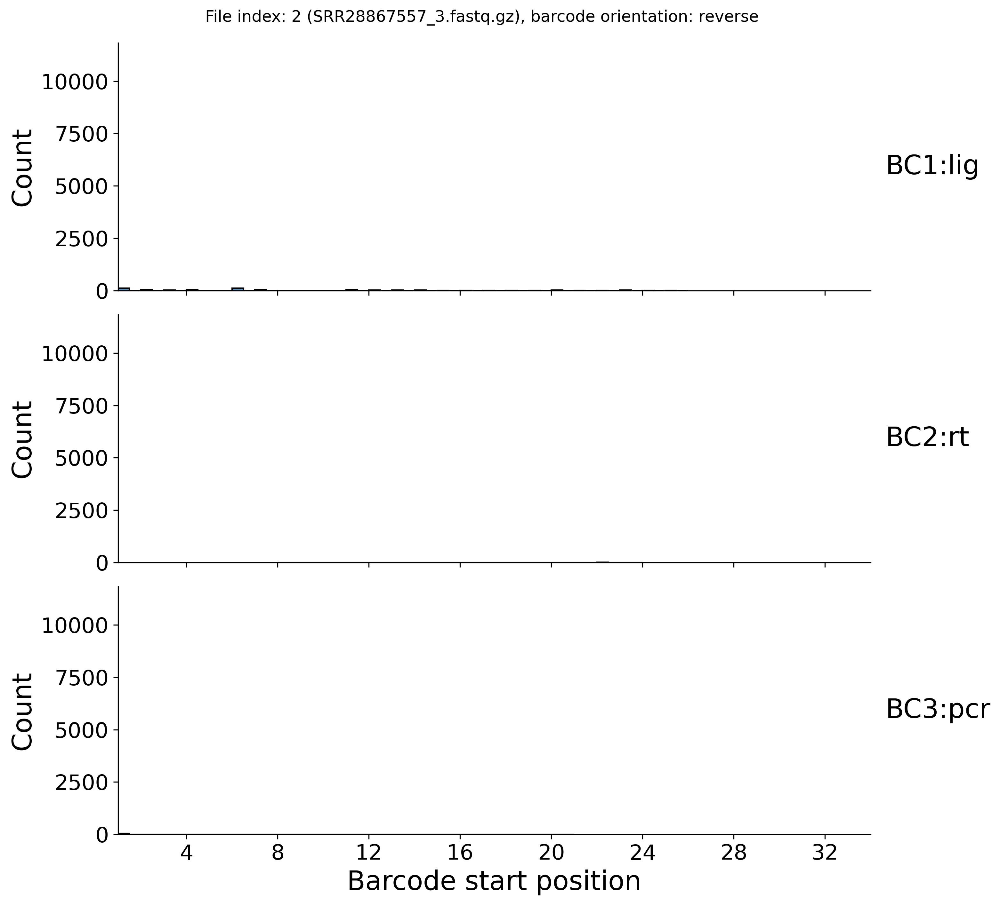
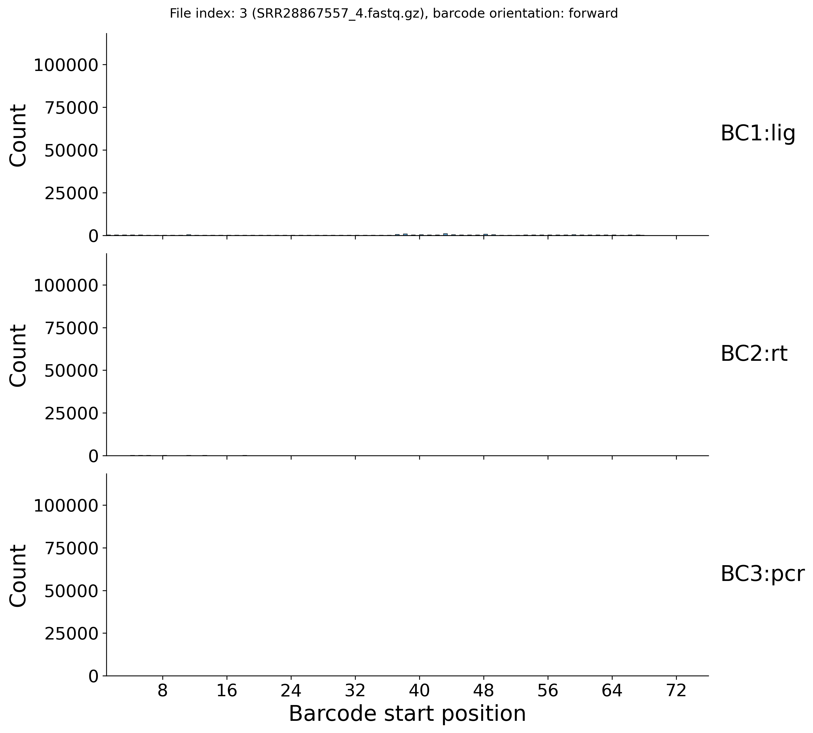
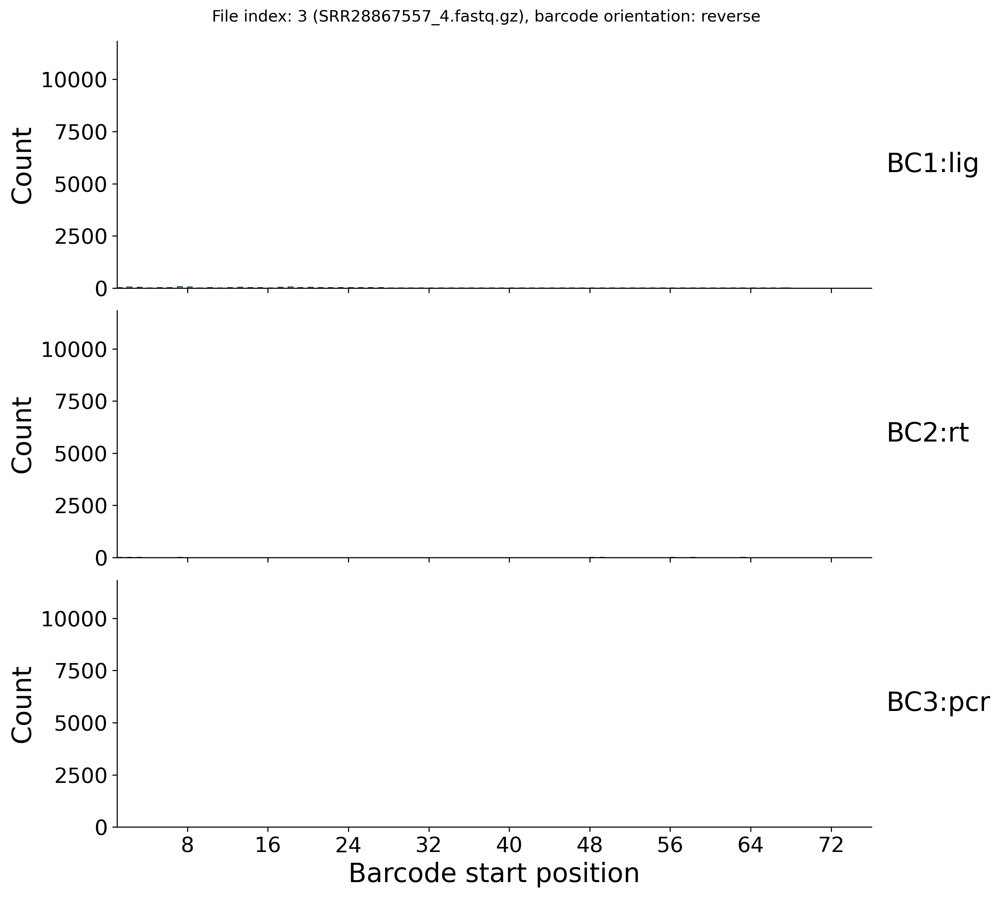

[Back to root](root.md)

# Example: Scale Biosciences (RNA)

<picture>
  <source media="(prefers-color-scheme: dark)" srcset="../img/scale_dark.svg">
  
</picture>

Library structure

---

### Prep

Stay organised - create a folder for the project to keep things tidy.

```bash
PROJECT=./scarecrow/examples/scale
mkdir -p ${PROJECT}
```

Download Evercode WTv2 data from [https://www.ebi.ac.uk/ena/browser/view/PRJNA1106903](https://www.ebi.ac.uk/ena/browser/view/PRJNA1106903).

```bash
mkdir -p ${PROJECT}/fastq
ACC=SRR28867557
prefetch --output-directory ${PROJECT}/fastq ${ACC}
fasterq-dump ${PROJECT}/fastq/${ACC} -e 2 --split-files --include-technical --force --outdir ${PROJECT}/fastq
gzip ${PROJECT}/fastq/${ACC}_1.fastq # Index 2
gzip ${PROJECT}/fastq/${ACC}_2.fastq # Index 1
gzip ${PROJECT}/fastq/${ACC}_3.fastq # This read contains the barcodes and UMI
gzip ${PROJECT}/fastq/${ACC}_4.fastq # This read contains the target sequence
```

### 1. Identify barcode seed positions

This step requires barcode whitelists associated with the assay being used. These are available in the references folder of the ScaleRna github repo: [https://github.com/ScaleBio/ScaleRna/tree/master/references](https://github.com/ScaleBio/ScaleRna/tree/master/references). We only require the barcode sequence for scarecrow, so this needs cutting from the ligation barcode (3lvlRNA_lig.txt), reverse transcription barcode (3lvlRNA_rt.txt), and pcr barcode (3lvlRNA_pcr.txt) files (i.e. `cut -f1 3lvlRNA_lig.txt > ${PROJECT}/barcode_whitelists/3lvlRNA_lig.txt`). Once the whitelists are generated, they can be defined as colon-delimited strings (`<barcode index>:<whitelist name>:<whitelist file>`) in a bash array for later use.

```bash
BARCODES=(BC1:lig:${PROJECT}/barcode_whitelists/3lvlRNA_lig.txt
          BC2:rt:${PROJECT}/barcode_whitelists/3lvlRNA_rt.txt
          BC3:pcr:${PROJECT}/barcode_whitelists/3lvlRNA_pcr.txt)
```

We can now run `scarecrow seed` to process each barcode whitelist. The below example is for a SLURM HPC, but will work on a standard PC by omitting the `sbatch` line. It randomly samples 10k reads from the first 100k in the FASTQ files and records the start positions of barcodes, their orientation, nucleotide frequencies per position, and conserved sequence runs.

```bash
mkdir -p ${PROJECT}/barcode_profiles
FASTQS=(${PROJECT}/fastq/*.fastq.gz)
for BARCODE in ${BARCODES[@]}
do
    sbatch --ntasks 1 --mem 1G --time=01:00:00 -o seed.%j.out -e seed.%j.err \
        scarecrow seed \
            --num_reads 10000 \
            --upper_read_count 100000 \
            --fastqs ${FASTQS[@]} \
            --barcodes ${BARCODE} \
            --out ${PROJECT}/barcode_profiles/barcodes.${BARCODE%%:*}.csv
done
```

### 2. Harvest seed data

The barcode profiles generated by `scarecrow seed` are gathered with `scarecrow harvest` to identify the likely barcode index positions. The `--barcode_count` parameter specifies the number of barcodes to return for **each** barcode index, and should typically be set to `1` unless debugging. The `--min_distance` parameter sets the minimum distance required between the end and start positions of two barcodes.

```bash
BARCODE_FILES=(${PROJECT}/barcode_profiles/barcodes.*.csv)
sbatch --ntasks 1 --mem 2G --time=01:00:00 -o harvest.%j.out -e harvest.%j.err \
    scarecrow harvest \
        ${BARCODE_FILES[@]} \
        --barcode_count 1 \
        --min_distance 10 \
        --out ${PROJECT}/barcode_profiles/barcode_positions.csv
```

The plot generated by `harvest` indicates that virtually barcode matches were found on read 1, in forward orientation at positions 1 and 24. This is consistent with the expectation from the (0-based) library structure described in the ScaleRna JSON [https://github.com/ScaleBio/ScaleRna/blob/master/references/libV1.1.i5_rc.json](https://github.com/ScaleBio/ScaleRna/blob/master/references/libV1.1.i5_rc.json).

<br>
<picture style="display: flex; justify-content: center; gap: 10px;">
  
  
</picture>
<picture style="display: flex; justify-content: center; gap: 10px;">
  
  
</picture>
<picture style="display: flex; justify-content: center; gap: 10px;">
  
  
</picture>

<br>

The regions for the three barcodes (one per whitelist) selected by the `harvest` are highlighted in blue. These are recorded in the barcode_positions.csv file.

```bash
barcode_whitelist,file_index,file,orientation,start,end,read_count,read_fraction
BC3:pcr,0,SRR28867557_1.fastq.gz,forward,1,10,98563,1.0
BC1:lig,2,SRR28867557_3.fastq.gz,forward,1,9,94315,1.0
BC2:rt,2,SRR28867557_3.fastq.gz,forward,24,33,50351,0.58
```


*TBC below*

### 4. Extract sequences and barcodes ###

Now that the barcode positions have been characterised we can extract the target sequence with `scarecrow reap`. This will also record barcode metadata (sequence, qualities, corrected sequence, positions, mismatches) and [*optionally*] UMI data (sequence, quailties). The output can be either SAM format (default) or FASTQ. The `--barcode_reverse_order` flag determines the order of barcode sequences in the tag. The range to `--extract` includes the read (`1` or `2`) followed by the positional range, and `--umi` follows the same format to indicate where the UMI sequence is. The `--jitter` parameter indicates the number of flanking bases to extend the barcode start position by when looking for a match. The `--mismatch` parameter indicates the maximum number of mismatches permitted when matching the barcode against a whitelist - also known as the edit distance. The `--base_quality` parameter base quality threshold below which bases are masked as `N`, this step occurs before barcode matching and can significantly reduce the number of valid barcodes if set too high. We recommend using the default `10` and applying additional quality filtering to the resulting output as required.

```bash
mkdir -p ${PROJECT}/extracted
THREADS=16
BQ=10
JITTER=2
MISMATCH=2
FASTQS=(${PROJECT}/fastq/*.trimmed.fastq)
OUT=$(basename ${FASTQS[0]%.fastq*})
sbatch --ntasks 1 --cpus-per-task ${THREADS} --mem 16G --time=12:00:00 -o reap.%j.out -e reap.%j.err \
    scarecrow reap \
        --threads ${THREADS} \
        --batch_size 20000 \
        --fastqs ${FASTQS[@]} \
        --barcode_positions ${PROJECT}/barcode_profiles/barcode_positions.csv \
        --barcode_reverse_order \
        --barcodes ${BARCODES[@]} \
        --extract 1:1-74 --umi 2:1-10 \
        --jitter ${JITTER} \
        --mismatch ${MISMATCH} \
        --base_quality ${BQ} \
        --out ${PROJECT}/extracted/${OUT} \
        --out_sam
```

In addition to generating the SAM file, `scarecrow reap` outputs a `_mismatch_stats.csv` and a `_position_stats.csv`. The mismatch_stats CSV has the following format:

```bash
mismatches,count
-3,5654876
-2,5249063
-1,16976272
0,126774904
1,11373736
2,1287519
3,156456
```

Indicating the number of reads recorded for each sum of mismatches across its barcodes. Negative numbers indicate the number of reads for which no barcode was found (i.e. -1 is one barcode unmatched, -2 is two barcodes unmatched, ...). Although we used `--mismatch 2`, a mismatch count of three is possible if for example each of the three barcodes has one mismatch, or one barcode has two mismatches and another has 1 mismatch.

The position_stats CSV follows a similar format, indicating the count of barcodes starting at each position within `--jitter 2` :

```bash
position,count
9,843639
10,2986137
11,162568743
12,792597
13,281710
47,1810251
48,8885605
49,154939989
50,1587644
51,249337
77,3125647
78,12576913
79,151770266
```

This illustrates that millions of reads have barcodes not starting at the expected positions.

### 5. Align with STAR

Given the compute requirements for running STAR this is best performed on a HPC. Alignment first requires the reference genome be indexed with STAR. Below is an example using 8 threads and used 48G on a SLURM HPC. The GRCh38 reference genome and annotation (GTF) were indexed using an overhang of 74 - the length of the read containing the sequence to align.

```bash
STAR --runThreadN ${SLURM_NTASKS} \
     --runMode genomeGenerate \
     --genomeDir ${GENOME_DIR} \
     --genomeFastaFiles ${GRCh38.FA} \
     --sjdbGTFfile ${GRCh38.GTF} \
     --sjdbOverhang 74
```

After indexing the reference genome, the SAM file generated by `scarecrow reap` is aligned using 32 threads and 48G on a SLURM HPC.

```bash
SAM=${PROJECT}/extracted/*.sam
ID=$(basename ${SAM})
mkdir -p ${PROJECT}/aligned

STAR --runThreadN ${SLURM_NTASKS} \
        --genomeDir ${GENOME_DIR} \
        --readFilesIn ${SAM} \
        --outFileNamePrefix ${PROJECT}/aligned/${ID%.sam}. \
        --outSAMtype BAM Unsorted \
        --outFilterMultimapNmax 3 
```

