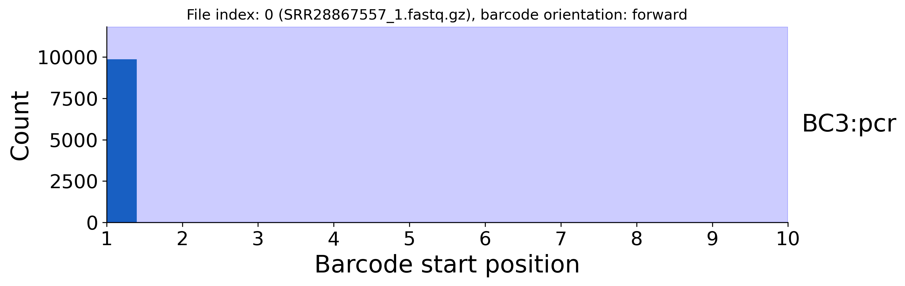

[Back to root](../README.md)

# Example: Scale Biosciences (QuantumnScale)

<picture>
  <source media="(prefers-color-scheme: dark)" srcset="../img/scale_dark.svg">
  
</picture>

Library structure

---

### Prep

Stay organised - create a folder for the project to keep things tidy.

```bash
PROJECT=./scarecrow/examples/Scale
mkdir -p ${PROJECT}
```

Download Scale Bio data from NCBI SRA accession:[SRR28867557](https://www.ncbi.nlm.nih.gov/sra/?term=SRR28867557).

```bash
mkdir -p ${PROJECT}/fastq
ACC=SRR28867557
prefetch --output-directory ${PROJECT}/fastq ${ACC}
fasterq-dump ${PROJECT}/fastq/${ACC} -e 2 --split-files --include-technical --force --outdir ${PROJECT}/fastq
gzip ${PROJECT}/fastq/${ACC}_1.fastq # Index 2
gzip ${PROJECT}/fastq/${ACC}_2.fastq # Index 1
gzip ${PROJECT}/fastq/${ACC}_3.fastq # This read contains the barcodes and UMI
gzip ${PROJECT}/fastq/${ACC}_4.fastq # This read contains the target sequence
```

### 1. Identify barcode seeds

This step requires barcode whitelists associated with the assay being used. These are available in the references folder of the ScaleRna github repo: [https://github.com/ScaleBio/ScaleRna/tree/master/references](https://github.com/ScaleBio/ScaleRna/tree/master/references). We only require the barcode sequence for scarecrow, so this needs cutting from the ligation barcode (3lvlRNA_lig.txt), reverse transcription barcode (3lvlRNA_rt.txt), and pcr barcode (3lvlRNA_pcr.txt) files (i.e. `cut -f1 3lvlRNA_lig.txt > ${PROJECT}/barcode_whitelists/3lvlRNA_lig.txt`). Once the whitelists are generated, barcodes can then be defined as colon-delimited strings (`<barcode index>:<whitelist name>:<whitelist file>`) in a bash array for later use. For convenience, we have provided in the `scarecrow` repo the below [barcode files](../barcodes/Scale).

```bash
BARCODES=(BC1:lig:${PROJECT}/barcode_whitelists/3lvlRNA_lig.txt
          BC2:rt:${PROJECT}/barcode_whitelists/3lvlRNA_rt.txt
          BC3:pcr:${PROJECT}/barcode_whitelists/3lvlRNA_pcr.txt)
```

We can now run `scarecrow seed` to process each barcode whitelist. The below example is for a SLURM HPC, but will work on a standard PC by omitting the `sbatch` line. It randomly samples 10k reads from the first 100k in the FASTQ files and records the start positions of barcodes, their orientation, nucleotide frequencies per position, and conserved sequence runs.

```bash
mkdir -p ${PROJECT}/barcode_profiles
FASTQS=(${PROJECT}/fastq/*.fastq.gz)
for BARCODE in ${BARCODES[@]}
do
    scarecrow seed \
        --num_reads 10000 \
        --upper_read_count 100000 \
        --fastqs ${FASTQS[@]} \
        --barcodes ${BARCODE} \
        --out ${PROJECT}/barcode_profiles/barcodes.${BARCODE%%:*}.csv
done
```

The above example uses the default set-based barcode matching method. The alternative is to use the trie-based method which is better suited to much larger barcode whitelists. In the below example we generate a k-mer index with k-mers of length 3 (see [encode](./toolkit_encode.md)).

```bash
K=3
mkdir -p ${PROJECT}/trie_k${K}/barcode_profiles
FASTQS=(${PROJECT}/fastq/*.fastq.gz)
for BARCODE in ${BARCODES[@]}
do
    scarecrow seed \
        --num_reads 10000 \
        --upper_read_count 100000 \
        --fastqs ${FASTQS[@]} \
        --barcodes ${BARCODE} \
        --pickle ${PROJECT}/trie_k${K}/barcodes.${BARCODE%%:*}.pkl.gz \
        --kmer_length ${K} \
        --out ${PROJECT}/trie_k${K}/barcode_profiles/barcodes.${BARCODE%%:*}.csv
done
```

### 2. Harvest barcode profiles

The barcode profiles generated by `scarecrow seed` are gathered with `scarecrow harvest` to identify the likely barcode index positions. The `--barcode_count` parameter specifies the number of barcodes to return for **each** barcode index, and should typically be set to `1` unless debugging. The `--min_distance` parameter sets the minimum distance required between the end and start positions of two barcodes.

```bash
BARCODE_FILES=(${PROJECT}/barcode_profiles/barcodes.*.csv)
scarecrow harvest \
    ${BARCODE_FILES[@]} \
    --barcode_count 1 \
    --min_distance 10 \
    --out ${PROJECT}/barcode_profiles/barcode_positions.csv
```

Both the set- and trie-based methods are processed in the same manner with `harvest`. However, to illustrate that the same barcode profiles are generated, we can repeat the above on the trie-based method outputs from `seed`.

```bash
BARCODE_FILES=(${PROJECT}/trie_k${K}/barcode_profiles/barcodes.*.csv)
scarecrow harvest \
    ${BARCODE_FILES[@]} \
    --barcode_count 1 \
    --min_distance 10 \
    --conserved ${PROJECT}/trie_k${K}/barcode_profiles/barcodes.${BARCODES[0]%%:*}_conserved.tsv \
    --out ${PROJECT}/trie_k${K}/barcode_profiles/barcode_positions.csv
```

The plots generated by `harvest` indicates that barcode matches were found on read 1 (SRR28867557_1.fastq.gz) in forward orientation at positions 1, and read 3 (SRR28867557_3.fastq.gz) in forward orentation at positions 1 and 24. This is consistent with the expectation from the (0-based) library structure described in the ScaleRna JSON [https://github.com/ScaleBio/ScaleRna/blob/master/references/libV1.1.i5_rc.json](https://github.com/ScaleBio/ScaleRna/blob/master/references/libV1.1.i5_rc.json). SRR28867557_2.fastq.gz returned a conserved sequence, indicated by the red shading. No matches were identified on SRR28867557_1.fastq.gz for barcodes in reverse orientation, or on SRR28867557_2.fastq.gz for barcodes in forward orientation. Matches were identified on SRR28867557_3.fastq.gz for barcodes in reverse orientation, and for SRR28867557_4.fastq.gz for barcodes in either orientation, resulting in plots being generated, although the counts were insignificant and returned no peaks.

<br>
<table>
  <tr>
    <td></td>
    <td></td>
  </tr>
  <tr>
    <td></td>
    <td></td>
  </tr>
  <tr>
    <td></td>
    <td></td>
  </tr>
</table>
<br>

The regions for the three barcodes (one per whitelist) identifed by `harvest` are highlighted in blue. These are recorded in the barcode_positions.csv file for use with `reap`.

```bash
barcode_whitelist,file_index,file,orientation,start,end,read_count,read_fraction
BC3:pcr,0,SRR28867557_1.fastq.gz,forward,1,10,9853,1.0
BC1:lig,2,SRR28867557_3.fastq.gz,forward,1,9,9407,1.0
BC2:rt,2,SRR28867557_3.fastq.gz,forward,24,33,4976,0.58
```

### 3. Reap sequence data ###

Now that the barcode positions have been characterised we can extract the target sequence with `scarecrow reap`. This will also record barcode metadata (sequence, qualities, corrected sequence, positions, mismatches) and UMI data (sequence, quailties). The output can be either SAM format (default) or FASTQ. The range to `--extract` requires a 1-based FASTQ index followed by the positional range (i.e. 4:1-76), and `--umi` follows the same format to indicate where the UMI sequence is (i.e. 3:17-24). The `--jitter` parameter indicates the number of flanking bases to extend the barcode start position by when looking for a match. As barcode 2 was found to start at positions 24 and 25 we should set `--jitter 1`. The `--mismatch` parameter indicates the maximum number of mismatches permitted when matching the barcode against a whitelist - also known as the edit distance.

We're running this on a SLURM HPC and it takes around an 2h30m using 16 cores.

```bash
THREADS=16
BQ=10
JITTER=0
MISMATCH=2
FASTQS=(${PROJECT}/fastq/*.fastq.gz)
OUT=$(basename ${FASTQS[0]%.fastq*})
mkdir -p ${PROJECT}/extracted/J${JITTER}M${MISMATCH}
sbatch --ntasks 1 --cpus-per-task ${THREADS} \
    --mem 8G --time=12:00:00 -o reap.%j.out -e reap.%j.err \
    scarecrow reap \
        --threads ${THREADS} \
        --batch_size 20000 \
        --fastqs ${FASTQS[@]} \
        --barcode_positions ${PROJECT}/barcode_profiles/barcode_positions.csv \
        --barcodes ${BARCODES[@]} \
        --extract 4:1-76 --umi 3:17-24 \
        --jitter ${JITTER} \
        --mismatch ${MISMATCH} \
        --base_quality ${BQ} \
        --out ${PROJECT}/extracted/J${JITTER}M${MISMATCH}/${OUT} \
        --out_fastq
```
# 2711017 (J0)

**(Optional)** Check that the read count in the resulting FASTQ file is equal to that of one of the input FASTQ files. Here is an example of counting reads using `seqtk` and `awk` on non-interleaved and interleaved FASTQ files.

```bash
# A non-interleaved input FASTQ file
seqtk seq ${FASTQS[0]} | awk '/^@/ {c++} END {print c}'
# Interleaved scarecrow FASTQ file
seqtk seq ${PROJECT}/extracted/J${JITTER}M${MISMATCH}/${OUT}.fastq | awk '/^@/ {c++} END {print c/2}'
```

In addition to generating an interleaved FASTQ file, `scarecrow` outputs a JSON file indicating the barcode and UMI positions on read 1, and the parameters required to use the file with the `kb count` tool of `kallisto-bustools`. In addition, the tools outputs a `_mismatch_stats.csv` and a `_position_stats.csv` file. The mismatch_stats CSV has the following format:

```bash
mismatches,count
-2,6675291
-1,37366978
0,293542244
1,12593597
2,4935434
3,357517
4,401159
5,17193
```

Indicating the number of reads recorded for each sum of mismatches across its barcodes. Negative numbers indicate the number of reads for which no barcode was found (i.e. -1 is one barcode unmatched, -2 is two barcodes unmatched, ...). Although we used `--mismatch 2`, a mismatch count of three is possible if for example each of the three barcodes has one mismatch, or one barcode has two mismatches and another has 1 mismatch.

The position_stats CSV follows a similar format, indicating the count of barcodes starting at each position within `--jitter 1` :

```bash
position,count
*,1551
-1,1372346
1,700463986
2,2446549
23,4500938
24,186144490
25,122020819
N,50717560
```

This illustrates that millions of reads have barcodes not starting at the expected positions. Note, the Scale Bio RNA library structure is as follows:

``` bash
# Read 1 (read_3.fastq.gz)  :   LIG (BC2) [1-9] | SPLINT (LINKER) [10-16] | UMI [17-24] | RT (BC1) [25-34]
# Index 2 (read_1.fastq.gz) :  PCR (BC3) [1-10]
```

The ScaleRna workflow uses the linker as an anchor for determining the offset start positions of the UMI and BC1, acknowledging that the linker could start at (0-based) position 8 or 9.

We observe a significant number of BC1 barcodes starting at position 24. We also note that 99% of BC2 barcodes end with a T nucleotide when BC1 starts at position 24. Manual inspection of read 3 sequences show that the linker sequence (`TCAGAGC`) often shares that `T` nt with BC1. For example, below is the first 10 reads with the linker sequence marked:

```bash
NACTGGCA`TCAGAGC`GTATCATTAGAGAAGGTTT
NTACCTAAG`TCAGAGC`ATTTGGCCGAAGATCGAG
NCAGATAC`TCAGAGC`ACGGGCTATAGATCTACTT
NCAGCGGT`TCAGAGC`GGAGGTTGCAGTGAGCCGA
NCTGGACC`TCAGAGC`TGGTGGAATTATTCATTCT
NTCTTCAGA`TCAGAGC`ATTCAAGCACTATGCAAT
NACGAGCG`TCAGAGC`CGCGGAGGGACCTTGATAT
NTCGGAGT`TCAGAGC`GATGACCCCGGATTAGAAT
NCAAGATCT`TCAGAGC`CTAACTAAACTTAACCTT
NCAATGCTA`TCAGAGC`AGGCTCTTGCCATTCTCC
```

In the above example, all of the BC2 sequences (first 9 bases) "truncated" by 1 nt has a barcode match that ends with `T`. This sharing of the `T` nucleotide between BC2 and linker impacts the positions of downstream UMI and BC1 elements. Below is an example:

```bash
@SRR28867557.450070 A01209:299:HH7MLDRX3:1:2102:24659:1204 length=34
TGGACCTCTCAGAGCGCTTACCACTCAATAGGTT
|||||||||                             BC2     (TGGACCTCT)
        |||||||.                      Linker  (TCAGAGC)
                ||||||||              UMI     (CTTACCAC expected position)
                       ||||||||||.    BC1     (CTCAATAGGT expected based on start 24)
                      ||||||||||..    BC1     (ACTCAATAGG exact barcode match)

```

The ScaleRna workflow appears to overcome this by using linker-anchor offset approach. However, in that approach BC1 would start at position 24, and the resulting BC1 sequence has no exact match in the 3lvlRNA_rt.txt whitelist. By contrast, there is an exact barcode match starting at position 23 which is detected by `scarecrow` when using `--jitter 1` on the expectation that BC1 starts at position 24. However, because `scarecrow` does not currently adjust the UMI position to account for jitter, this results in a 2 nt overlap between the UMI and BC1. **Consequently, downstream tools (e.g. umi-tools) can be used for UMI correction**.

If using the trie-based method, `reap` would be run using the pickle indices instead of the whitelists, as follows:

```bash
THREADS=16
BQ=10
JITTER=1
MISMATCH=2
FASTQS=(${PROJECT}/fastq/*.fastq.gz)
BARCODES=(BC1:lig:${PROJECT}/trie_k${K}/barcodes.BC1.pkl.gz
          BC2:rt:${PROJECT}/trie_k${K}/barcodes.BC2.pkl.gz
          BC3:pcr:${PROJECT}/trie_k${K}/barcodes.BC3.pkl.gz)
OUT=$(basename ${FASTQS[0]%.fastq*})
mkdir -p ${PROJECT}/extracted/trie_k${K}/J${JITTER}M${MISMATCH}
sbatch -p uoa-compute --ntasks 1 --cpus-per-task ${THREADS} \
    --mem 16G --time=24:00:00 -o reap.%j.out -e reap.%j.err \
    scarecrow reap \
        --threads ${THREADS} \
        --batch_size 20000 \
        --fastqs ${FASTQS[@]} \
        --barcode_positions ${PROJECT}/trie_k${K}/barcode_profiles/barcode_positions.csv \
        --barcodes ${BARCODES[@]} \
        --extract 4:1-76 --umi 3:17-24 \
        --jitter ${JITTER} \
        --mismatch ${MISMATCH} \
        --base_quality ${BQ} \
        --out ${PROJECT}/extracted/trie_k${K}/J${JITTER}M${MISMATCH}/${OUT} \
        --out_fastq
```

The below table summarises the number of mismatches identified at each jitter from 0 to 1, allowing upto 2 mismatches.

| Mis | Jitter 0  | Jitter 1  |
| --- | --------- | --------- |
| -2  | 10191330  | 6675291
| -1  | 156364488 | 37366978
| 0   | 175732492 | 293542244
| 1   | 6870125   | 12593597
| 2   | 6255723   | 4935434
| 3   | 231657    | 357517
| 4   | 234255    | 401159
| 5   | 9343      | 17193

The number of valid barcodes is the sum of those with >=0 mismatches. This can be easily calculated from the mismatch stats file.

```bash
OUT=$(basename ${FASTQS[0]%.gz})
awk -F, 'NR>1 && $1 >= 0 {sum += $2} END {print sum}' $PROJECT/extracted/J${JITTER}M${MISMATCH}/${OUT}_mismatch_stats.csv
```

The below table summarises the number of barcode position matches identified at each jitter from 0 to 1, allowing upto 2 mismatches.

| Pos | Jitter 0  | Jitter 1  |
| --- | --------- | --------- |
| *   |           | 1551      |
| -1  |           | 1372346   |
| 1   | 700879847 | 700463986 |
| 2   |           | 2446549   |
| 23  |           | 4500938   |
| 24  | 190041244 | 186144490 |
| 25  |           | 122020819 |
| N   | 176747148 | 50717560  |

The Scale barcode whitelists have 96 (3lvlRNA_rt and 3lvlRNA_pcr) and 384 (3lvlRNA_lig) 9-mer barcodes. Given the small size of these whitelists the default set-based method is more efficient, as evident from the SLURM job logs summarised below (JITTER = 1, MISMATCH = 2). Whilst both k-mer lengths reported the same results, as would be expected for the k lengths tested (see [encode](./toolkit_encode.md)), there is a significant difference in run-time between k = 2 and k = 3.

| Method            | CPU Utilized | CPU Efficiency | Wall-clock time | Memory Utilized |
| ----------------- | ------------ | -------------- | --------------- | --------------- |
| Set (J0M2)        | 16:08:54     | 30.57%         | 03:18:06        | 3.53 GB         |
| Set (J1M2)        | 19:51:06     | 38.79%         | 03:11:56        | 3.52 GB         |
| Trie 2-mer (J1M2) | 9-05:21:50   | 98.10%         | 14:06:14        | 5.41 GB         |
| Trie 3-mer (J1M2) | 2-23:22:17   | 94.94%         | 04:41:55        | 5.18 GB         |

| Pos | Set       | Trie 2-mer | Trie 3-mer |
| --- | --------- | ---------- | ---------- |
| *   | 1551      | 1551       | 1551
| -1  | 1372346   | 1372346    | 1372346    |
| 1   | 700463986 | 700463986  | 700463986  |
| 2   | 2446549   | 2446549    | 2446549    |
| 23  | 4500938   | 4500938    | 4500938    |
| 24  | 186144490 | 186144490  | 186144490  |
| 25  | 122020819 | 122020819  | 122020819  |
| N   | 50717560  | 50717560   | 50717560   |

| Mis | Set       | Trie 2-mer | Trie 3-mer |
| --- | --------- | ---------- | ---------- |
| -2  | 6675291   | 6676515    | 6675291    |
| -1  | 37366978  | 37366978   | 37366978   |
| 0   | 293542244 | 293542244  | 293542244  |
| 1   | 12593597  | 12593597   | 12593597   |
| 2   | 4935434   | 4935434    | 4935434    |
| 3   | 357517    | 357517     | 357517     |
| 4   | 401159    | 401159     | 401159     |
| 5   | 17193     | 17193      | 17193      |


### 4. Sift reads with invalid barcodes

Reads with one or more invalid barcode are uninformative in downstream analyses as they could not be confidently demultiplexed. We can filter these reads out either by using the `--sift` flag when running `reap`, or by using the `sift` tool afterwards. Here we demonstrate `sift` after running `reap`. As we are providing a `scarecrow` FASTQ input we also need to provide the accompanying JSON file. If a `scarecrow` SAM input is provided then no JSON file is required.

```bash
OUT=$(basename ${FASTQS[0]%.fastq.gz})
FASTQ=${PROJECT}/extracted/J${JITTER}M${MISMATCH}/${OUT}.fastq
sbatch -p uoa-compute --ntasks 1 --mem 2G --time=12:00:00 -o sift.%j.out -e sift.%j.err \
            scarecrow sift --in ${FASTQ} --json ${FASTQ%.fastq}.json
```
# 2711158 (J0)
# 2711125 (J1)

### 5. Trimming

To improve downstream alignment results it is highly recommended to trim the reads to remove and adapter sequences or template switching oligo (TSO) sequences. Not all reads possess these sequences, and those that do will not necessarily share the same start position. There is a contaminants list in the Parse splitpipe repo which can be formatted for use with cutadapt. Note, we use the `-G` rather than the `-g` flag for `cutadapt` because the sequence to be trimmed is on the read 2 output by `scarecrow`, rather than read 1.

```bash
CONTAMINANTS=~/sharedscratch/software/ParseBiosciences-Pipeline.1.4.1/splitpipe/scripts/config/fastqc-contaminant_list.txt
awk '
# Skip blank lines and comment lines
NF && $0 !~ /^#/ {
  seq = $NF
  header = ""
  for (i = 1; i < NF; i++) {
    header = header $i " "
  }
  gsub(/[ \t]+$/, "", header)
  # Use a separate array to track seen sequences
  if (header != "" && !(seq in seen)) {
    seen[seq] = 1
    print ">" header
    print seq
  }
}
' ${CONTAMINANTS} > ${PROJECT}/contaminants.fasta

OUT=$(basename ${FASTQS[0]%.fastq.gz})
FASTQ=$(basename ${PROJECT}/extracted/J${JITTER}M${MISMATCH}/${OUT}_sift.fastq)
sbatch --ntasks 1 --cpus-per-task 4 --mem 16G --time=12:00:00 -o cutadapt.%j.out -e cutadapt.%j.err \
    cutadapt --cores 4 --trim-n --minimum-length 30 --interleaved \
        -G file:${PROJECT}/contaminants.fasta \
        -o ${PROJECT}/extracted/J${JITTER}M${MISMATCH}/${FASTQ%_sift.fastq}_trimmed.fastq \
        ${PROJECT}/extracted/J${JITTER}M${MISMATCH}/${FASTQ}
```
# 2711164 (J0)
# 2711159 (J1)

### 6. Generate barcode statistics

```bash
OUT=$(basename ${FASTQS[0]%.fastq.gz})
FASTQ=${PROJECT}/extracted/J${JITTER}M${MISMATCH}/${OUT}_trimmed.fastq
sbatch -p uoa-compute --ntasks 1 --mem 4G --time=12:00:00 -o stats.%j.out -e stats.%j.err \
            scarecrow stats --in ${FASTQ}
```
# 2711458 (J0)
# 2711459 (J1)

### 7. Generate count matrix via kallisto-bustools

Next we can generate a count matrix using `kallisto`. There is a script in the scarecrow repo, [kallisto.sh](../src/HPC/kallisto.sh), that parses the JSON file generated by `reap` to retrieve the `-x` string required for running the FASTQ file with `kb count`. This requires the JSON sed-like processor, [`jq`](https://jqlang.org), to be installed. This enables the `-x` flag to be extracted as follows:

```bash
XSTR=$(${jq} -r '."kallisto-bustools"[0]."kb count" | capture("-x (?<x>[^ ]+)").x' ${JSON})
```

The `kallisto.sh` script requires the `kallisto` `--index` and `--genes` for the reference assembly in question, in addition to the FASTQ and JSON files generated by `scarecrow`.

```bash
#conda deactivate
#mamba activate kallisto
mkdir -p ${PROJECT}/kallisto/J${JITTER}M${MISMATCH}
OUT=$(basename ${FASTQS[0]%.fastq.gz})
FASTQ=$(basename ${PROJECT}/extracted/J${JITTER}M${MISMATCH}/${OUT}_trimmed.fastq)
sbatch -p uoa-compute --ntasks 1 --cpus-per-task 8 --mem 4G --time=12:00:00 --dependency=afterok:2711459 \
    ~/sharedscratch/scarecrow/scripts/kallisto.sh \
        --index /uoa/scratch/users/s14dw4/software/kallisto/hg38/transcriptome.idx \
        --genes /uoa/scratch/users/s14dw4/software/kallisto/hg38/transcripts_to_genes.txt \
        --fastq ${PROJECT}/extracted/J${JITTER}M${MISMATCH}/${FASTQ} \
        --json ${PROJECT}/extracted/J${JITTER}M${MISMATCH}/${FASTQ%_trimmed.fastq}.json \
        --out ${PROJECT}/kallisto/J${JITTER}M${MISMATCH}/${FASTQ%.fastq}
```

# 2712596 (J0)
# 2712597 (J1)


### 8. Generate count matrix via STAR and umi-tools

Before aligning with STAR, if we wish to incoprorate the barcode and UMI read tags we should first recast the FASTQ file to SAM format.

```bash
OUT=$(basename ${FASTQS[0]%.fastq.gz})
FASTQ=${PROJECT}/extracted/J${JITTER}M${MISMATCH}/${OUT}_trimmed.fastq
sbatch -p uoa-compute --ntasks 1 --mem 2G --time=24:00:00 -o recast.%j.out -e recast.%j.err \
            scarecrow recast --in ${FASTQ}
```

# 2712650 (J0)
# 2712649 (J1)


Given the compute requirements for running STAR this is best performed on a HPC. Alignment first requires the reference genome be indexed with STAR. Below is an example using 8 threads and used 48G on a SLURM HPC. The GRCh38 reference genome and annotation (GTF) were indexed using an overhang of 74 - the length of the read containing the sequence to align.

```bash
STAR --runThreadN ${SLURM_NTASKS} \
     --runMode genomeGenerate \
     --genomeDir ${GENOME_DIR} \
     --genomeFastaFiles ${GRCh38.FA} \
     --sjdbGTFfile ${GRCh38.GTF} \
     --sjdbOverhang 74
```

Next, we align with `STAR` from `scarecow` SAM format.

```bash
mkdir -p ${OUT}
ID=$(basename ${SAM%.sam})
/uoa/scratch/users/s14dw4/software/STAR --runThreadN ${SLURM_CPUS_PER_TASK} \
        --genomeDir ${GENOME} \
        --readFilesIn ${SAM} \
        --readFilesType SAM SE \
        --outFileNamePrefix ${OUT}/${ID}. \
        --outSAMtype BAM Unsorted \
        --outFilterMultimapNmax 3
```

The script is run on the HPC as follows:

```bash
mkdir -p ${PROJECT}/star/J${JITTER}M${MISMATCH}
OUT=$(basename ${FASTQS[0]%.fastq.gz})
SAM=${PROJECT}/extracted/J${JITTER}M${MISMATCH}/${OUT}_trimmed.sam
ID=$(basename ${SAM%.sam})
GENOME=/uoa/scratch/users/s14dw4/spipe/genomes/hg38
sbatch -p uoa-compute --ntasks 1 --cpus-per-task 32 --mem 24G --time=02:00:00 -o star.%j.out -e star.%j.err \
    ./scarecrow/scripts/star_align_sam_scale.sh \
        --genome ${GENOME} \
        --sam ${SAM} \
        --out ${PROJECT}/star/J${JITTER}M${MISMATCH}
```

# 2712852 (J0)
# 2712889 (J1)


Next step is to run `umi-tools`. The reference GTF file we use for this has a slighltly different config naming convention to the reference we used for alignment with `STAR`. To address this issue we generate an alias file for use with `featureCounts` from the `subread` package, see the `umi-tools` [single-cell tutorial](https://umi-tools.readthedocs.io/en/latest/Single_cell_tutorial.html) for more details. We have included a script in the `scarecrow` repo, [umi_tools.sh](../src/HPC/umi_tools.sh) which runs `featureCounts` followed by `umi-tools count` to generate a counts matrix.

```bash
GTF=/uoa/scratch/shared/Morgan_Lab/common_resources/cellranger/reference/refdata-gex-GRCh38-2020-A/genes/genes.gtf
OUT=$(basename ${FASTQS[0]%.fastq.gz})
BAM=${PROJECT}/star/J${JITTER}M${MISMATCH}/*.bam

# Need to create contig look-up as GTF does not have hg38_ prefix to contigs
mkdir -p ${PROJECT}/umi_tools/J${JITTER}M${MISMATCH}
samtools view -H ${BAM} | cut -f2 | grep "^SN" | sed 's/SN://g' | \
    awk '{split($0, TIG, "_"); print TIG[2]","$0;}' > ${PROJECT}/umi_tools/alias.file

# Run UMI-tools
sbatch --partition uoa-compute ./scarecrow/scripts/umi_tools.sh \
    --bam ${BAM} \
    --gtf ${GTF} \
    --out ${PROJECT}/umi_tools/J${JITTER}M${MISMATCH} \
    --alias ${PROJECT}/umi_tools/alias.file
```
# 2712929 (J0)
# 2712930 (J1)

# <------------------------------------------------------------------ here


Next, the umi_tools output can be converted to a matrix format for downstream processing in R in a similar manner to the `kallisto` output.

```bash
COUNTS=${PROJECT}/umi_tools/J${JITTER}M${MISMATCH}/*.featureCounts.counts.tsv.gz
sbatch --partition uoa-compute ./scarecrow/scripts/counts2mtx.sh --in ${COUNTS}
```
